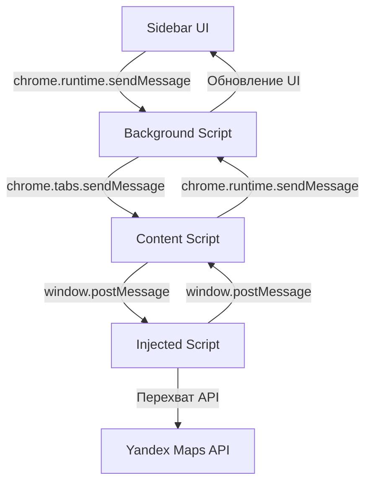

# 🔌 API Документация

Документация по внутреннему API расширения YandexParser Analytics.

## 📋 Содержание

- [Архитектура](#архитектура)
- [Background Script API](#background-script-api)
- [Content Script API](#content-script-api)
- [Injected Script API](#injected-script-api)
- [Структуры данных](#структуры-данных)
- [События и сообщения](#события-и-сообщения)

## 🏗️ Архитектура



## 🔧 Background Script API

### Сообщения (Messages)

#### `startCollection`
Начинает сбор данных.

```javascript
chrome.runtime.sendMessage({
  action: 'startCollection'
}, (response) => {
  console.log(response); // { status: 'started' }
});
```

#### `stopCollection`
Останавливает сбор данных.

```javascript
chrome.runtime.sendMessage({
  action: 'stopCollection'
}, (response) => {
  console.log(response); // { status: 'stopped' }
});
```

#### `getCollectedData`
Получает собранные данные.

```javascript
chrome.runtime.sendMessage({
  action: 'getCollectedData'
}, (response) => {
  console.log(response); 
  // {
  //   data: [...],
  //   isCollecting: false,
  //   count: 150
  // }
});
```

#### `addClinicData`
Добавляет новые данные в коллекцию (используется content script).

```javascript
chrome.runtime.sendMessage({
  action: 'addClinicData',
  data: [...], // Массив объектов организаций
  url: 'https://...',
  timestamp: Date.now()
}, (response) => {
  console.log(response); // { status: 'success', added: 25 }
});
```

#### `setCollectionLimit`
Устанавливает лимит сбора.

```javascript
chrome.runtime.sendMessage({
  action: 'setCollectionLimit',
  limit: 1000
}, (response) => {
  console.log(response); // { status: 'updated', limit: 1000 }
});
```

#### `exportData`
Экспортирует собранные данные.

```javascript
chrome.runtime.sendMessage({
  action: 'exportData'
}, (response) => {
  console.log(response); // { status: 'exported', filename: '...' }
});
```

#### `clearData`
Очищает собранные данные.

```javascript
chrome.runtime.sendMessage({
  action: 'clearData'
}, (response) => {
  console.log(response); // { status: 'cleared' }
});
```

### Функции

#### `deduplicateItems(newItems, existingData)`
Удаляет дубликаты из новых данных **только по уникальному ID**.

**Параметры:**
- `newItems` (Array) - новые элементы для проверки
- `existingData` (Array) - существующие данные

**Возвращает:** Array - уникальные элементы

**Алгоритм:**
1. **Проверка по ID организации** - основной и единственный критерий
2. **Карточки без ID** - пропускаются (редкий случай)
3. **Быстрая проверка** - используется Set для O(1) поиска

**Преимущества нового подхода:**
- ⚡ **Высокая скорость** - O(n) вместо O(n²)
- 🎯 **100% точность** - ID уникальны в Яндекс.Картах
- 🧹 **Простота кода** - убраны сложные расчеты координат и схожести
- 📊 **Лучшая производительность** - меньше потребление памяти

#### ~~`calculateTitleSimilarity(title1, title2)`~~ (Удалена)
~~Вычисляет схожесть названий (алгоритм Жаккара).~~

**Статус:** 🗑️ **Удалена в v2.1** - больше не используется для дедупликации

#### ~~`calculateDistance(lat1, lon1, lat2, lon2)`~~ (Удалена)
~~Вычисляет расстояние между координатами.~~

**Статус:** 🗑️ **Удалена в v2.1** - больше не используется для дедупликации

## 📄 Content Script API

### Функции внедрения

Content script автоматически внедряет:
- `injected.js` - для перехвата API
- `auto-scroll.js` - для автопрокрутки

### Обработка сообщений

#### От Injected Script
```javascript
window.addEventListener('message', function(event) {
  if (event.data.type === 'CLINIC_DATA_INTERCEPTED') {
    // Пересылка данных в background script
    chrome.runtime.sendMessage({
      action: 'addClinicData',
      data: event.data.clinics,
      url: event.data.url,
      timestamp: event.data.timestamp
    });
  }
});
```

#### От Background Script
```javascript
chrome.runtime.onMessage.addListener((message, sender, sendResponse) => {
  if (message.action === 'startAutoScroll') {
    window.postMessage({
      type: 'START_AUTO_SCROLL',
      scrollSpeed: message.scrollSpeed,
      maxScrolls: message.maxScrolls
    }, '*');
  }
});
```

## 🎯 Injected Script API

### Основные функции

#### `checkIfClinicRelated(url, options)`
Проверяет, относится ли URL к данным организаций.

**Параметры:**
- `url` (String) - URL запроса
- `options` (Object) - опции запроса

**Возвращает:** Boolean

**Ключевые слова:**
```javascript
const yandexPatterns = [
  'maps.yandex.ru',
  '/maps/api/',
  '/search',
  '/businesscard',
  '/geosearch'
];

const keywords = [
  'clinic', 'medical', 'business', 'organization',
  'клиника', 'медицин', 'бизнес', 'организац'
];
```

#### `extractClinicsFromResponse(data, url)`
Извлекает данные организаций из API ответа.

**Параметры:**
- `data` (Object) - JSON ответ от API
- `url` (String) - URL источника

**Возвращает:** Array - массив обработанных организаций

#### `processBusinessObject(item, sourceUrl)`
Обрабатывает один бизнес-объект.

**Параметры:**
- `item` (Object) - сырые данные организации
- `sourceUrl` (String) - URL источника

**Возвращает:** Object|null - обработанная организация или null

#### `calculateDataQuality(clinic)`
Вычисляет качество данных организации.

**Параметры:**
- `clinic` (Object) - данные организации

**Возвращает:** Number (0-1) - оценка качества

**Критерии качества:**
- Наличие названия: 20%
- Наличие адреса: 20%
- Наличие координат: 15%
- Наличие телефона: 15%
- Наличие рейтинга: 10%
- Наличие отзывов: 10%
- Наличие категории: 10%

### События

#### `CLINIC_DATA_INTERCEPTED`
Отправляется при успешном перехвате данных.

```javascript
window.postMessage({
  type: 'CLINIC_DATA_INTERCEPTED',
  clinics: [...], // Массив организаций
  url: 'https://...',
  timestamp: Date.now()
}, '*');
```

## 📊 Структуры данных

### Объект организации

```javascript
{
  "type": "business",
  "id": "1018899819",
  "title": "Медицинский центр",
  "shortTitle": "Мед центр",
  "description": "Описание организации",
  "address": "ул. Примерная, 123, Москва",
  "coordinates": [37.6176, 55.7558], // [longitude, latitude]
  "displayCoordinates": [37.6176, 55.7558],
  "bounds": [[37.61, 55.75], [37.62, 55.76]],
  "uri": "ymapsbm1://org?oid=1018899819",
  "url": "https://example.com",
  "ratingData": {
    "ratingCount": 150,
    "ratingValue": 4.5,
    "reviewCount": 89
  },
  "categories": [{
    "id": "184106394",
    "name": "Медицинский центр",
    "class": "medical",
    "seoname": "medical_center"
  }],
  "phones": ["+7 (495) 123-45-67"],
  "workingHours": [{
    "days": "пн-пт",
    "hours": "9:00-18:00"
  }],
  "website": "https://clinic.example.com",
  "email": "info@clinic.example.com",
  "features": ["Платные услуги", "Запись онлайн"],
  "services": ["Терапия", "Кардиология"],
  "photos": ["https://..."],
  "verified": true,
  "dataQuality": 0.85,
  "sourceUrl": "https://maps.yandex.ru/...",
  "collectedAt": "2025-01-04T12:00:00.000Z"
}
```

### Статистика коллекции

```javascript
{
  "totalFound": 1554,
  "withRating": 1330,
  "withReviews": 403,
  "withAddress": 623,
  "withCoordinates": 1554,
  "withPhones": 581,
  "withCategories": 623,
  "withWorkingHours": 245,
  "averageDataQuality": "62.5%"
}
```

### Экспортируемые данные

```javascript
{
  "data": {
    "requestId": "clinic-collector-1757001676744",
    "requestSerpId": "collector-2025-01-04T12-00-00-000Z",
    "requestContext": "Collected by Clinic Data Collector Extension v2.0",
    "requestQuery": "business cards data collection",
    "displayType": "multiple",
    "totalResultCount": 1554,
    "requestResults": 1554,
    "collectionLimit": 5000,
    "collectionStats": { /* статистика */ },
    "items": [ /* массив организаций */ ]
  }
}
```

## 📡 События и сообщения

### Типы сообщений между компонентами

#### Sidebar → Background
- `startCollection` - начать сбор
- `stopCollection` - остановить сбор
- `getCollectedData` - получить данные
- `setCollectionLimit` - установить лимит
- `exportData` - экспортировать данные
- `clearData` - очистить данные

#### Background → Content
- `startAutoScroll` - запустить автопрокрутку
- `stopAutoScroll` - остановить автопрокрутку

#### Content → Injected
- `START_AUTO_SCROLL` - начать автопрокрутку
- `STOP_AUTO_SCROLL` - остановить автопрокрутку

#### Injected → Content
- `CLINIC_DATA_INTERCEPTED` - данные перехвачены
- `AUTO_SCROLL_STATUS` - статус автопрокрутки

#### Content → Background
- `addClinicData` - добавить данные
- `autoScrollStatus` - статус автопрокрутки

## 🔍 Отладка API

### Логирование

Все компоненты используют префиксы для логов:
- `[YandexParser Analytics]` - injected script
- `[Content Script]` - content script
- `[Background]` - background script
- `[Sidebar]` - sidebar script
- `[Auto Scroll]` - auto-scroll script

### Проверка состояния

```javascript
// В консоли браузера
chrome.runtime.sendMessage({action: 'getCollectedData'}, console.log);

// Проверка статуса сбора
chrome.runtime.sendMessage({action: 'getCollectionStatus'}, console.log);

// Получение статистики
chrome.runtime.sendMessage({action: 'getStats'}, console.log);
```

### Тестовые функции

```javascript
// Симуляция данных (в injected script контексте)
window.postMessage({
  type: 'CLINIC_DATA_INTERCEPTED',
  clinics: [{
    title: 'Тестовая клиника',
    address: 'Тестовый адрес',
    coordinates: [37.6176, 55.7558]
  }],
  url: window.location.href,
  timestamp: Date.now()
}, '*');
```

## ⚠️ Ограничения и особенности

### Безопасность
- Все данные обрабатываются локально
- Нет отправки данных на внешние серверы
- Соблюдение Same-Origin Policy

### Производительность
- Максимальный лимит сбора: 10,000 карточек
- Автоматическая очистка памяти при превышении лимитов
- Throttling API запросов для предотвращения блокировки

### Совместимость
- Manifest V3 (Chrome 88+)
- Поддержка современных JavaScript API
- Graceful degradation для старых браузеров
